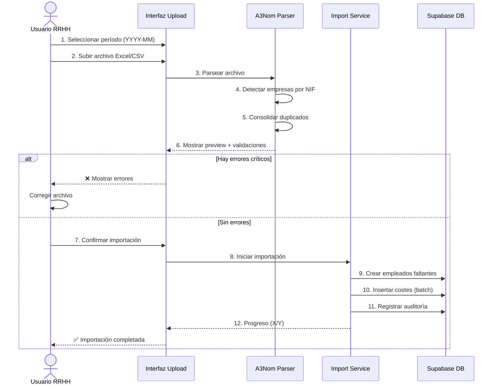
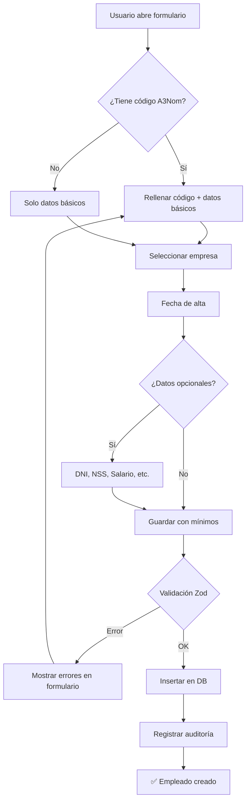
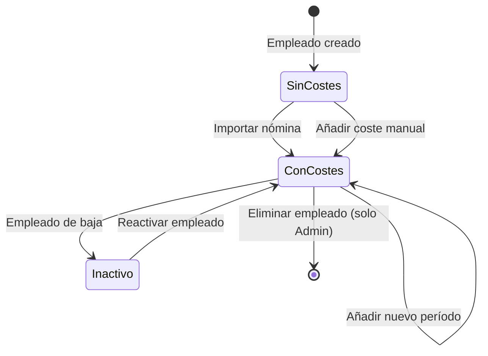
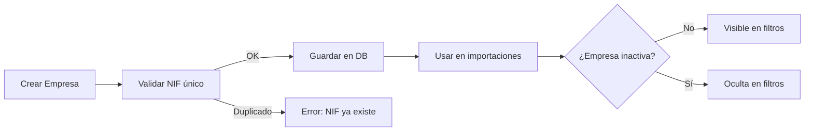
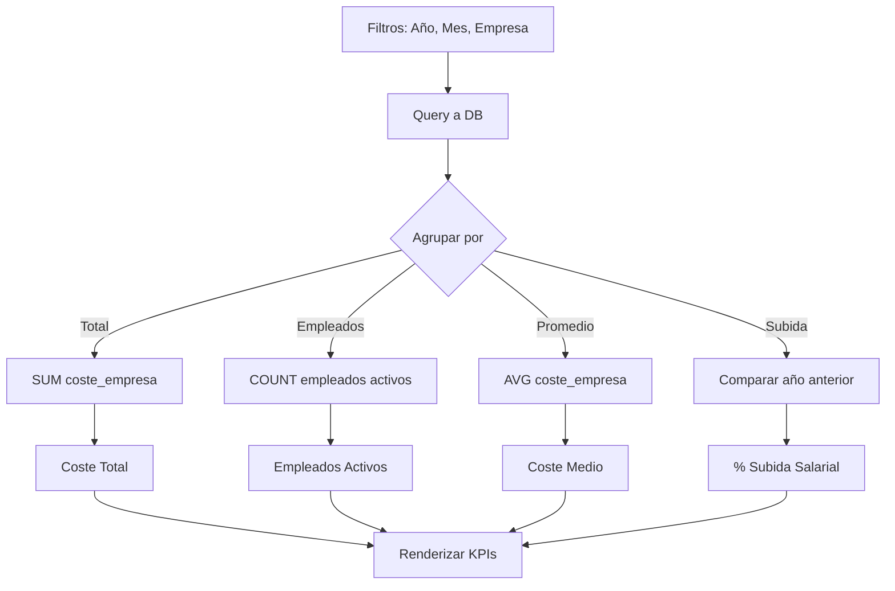

# Flujos de Trabajo - Control de Costes

## 📋 Índice
1. [Flujo: Importación A3Nom](#flujo-importación-a3nom)
2. [Flujo: Creación de Empleado](#flujo-creación-de-empleado)
3. [Flujo: Gestión de Costes](#flujo-gestión-de-costes)
4. [Matriz de Permisos](#matriz-de-permisos-por-rol)

---

## 🔄 Flujo: Importación A3Nom

### Diagrama de Secuencia



### Pasos Detallados

#### 1. Preparación en A3Nom
- Exportar nóminas del mes → Excel
- Guardar archivo localmente

#### 2. Carga del Archivo
- Seleccionar período de nómina
- Arrastrar archivo a zona de carga
- Sistema analiza estructura (5-30 seg)

#### 3. Validación Automática
- ✅ Empresas existen en catálogo
- ✅ Formato de fechas correcto
- ✅ Coste empresa >= Bruto
- ✅ Empleados consolidados

#### 4. Preview de Datos
- Tabla con primeras 10 filas
- Filas duplicadas resaltadas en rojo
- Resumen de validación

#### 5. Confirmación
- Botón "Importar X Registros"
- Barra de progreso en tiempo real

#### 6. Resultado
- ✅ Empleados creados: X
- ✅ Costes importados: Y
- ⚠️ Warnings (si los hay)

---

## 👤 Flujo: Creación de Empleado

### Diagrama de Flujo



### Campos Obligatorios vs Opcionales

| Campo | Obligatorio | Validación |
|-------|-------------|------------|
| **Nombre Completo** | ✅ Sí | Min 3 caracteres |
| **Empresa** | ✅ Sí | Debe existir en catálogo |
| **Fecha de Alta** | ✅ Sí | Formato YYYY-MM-DD |
| **Código Empleado** | ❌ No | Único si se proporciona |
| **DNI/NIE** | ❌ No | Formato 8 números + letra |
| **NSS** | ❌ No | 12 dígitos |
| **Salario Base** | ❌ No | Número positivo |

### Tooltips Informativos

Los siguientes campos tienen tooltips (icono ℹ️) con ayuda contextual:

- **Código Empleado**: "Código único de A3Nom. Si no lo conoces, déjalo vacío y se generará automáticamente al importar datos."
- **NSS**: "Número de Seguridad Social de 12 dígitos. Necesario para nóminas y Seguridad Social."
- **Salario Base Anual**: "Salario bruto anual pactado en contrato (sin pagas extra, bonus ni incentivos). Se usa para calcular desviaciones."
- **Fecha de Antigüedad**: "Fecha para cálculo de antigüedad (puede ser diferente a la fecha de alta si hubo traslado desde otra empresa)."
- **Traslado del Grupo**: "Marca esta opción si el empleado proviene de otra empresa del grupo. Se usará para detectar traspasos internos."
- **Tipo de Contrato**: "Ej: Indefinido, Temporal, Prácticas, Autónomo (TRADE). Afecta a cálculos de indemnización."

---

## 💰 Flujo: Gestión de Costes

### Diagrama de Estados



### Escenarios Comunes

#### 1. Corrección de Error en Nómina

```markdown
**Situación:** El bruto de Octubre está mal cargado

**Solución:**
1. Ir a ficha de empleado → Pestaña "Costes"
2. Clic en fila de Octubre
3. Editar campo "Bruto"
4. Guardar
5. ✅ Se recalcula automáticamente el delta
```

#### 2. Empleado con Período Faltante

```markdown
**Situación:** El empleado no aparece en la importación de Septiembre

**Solución:**
1. Verificar si estaba dado de alta en Septiembre (fecha de alta)
2. Si debe tener coste:
   - Ir a pestaña "Costes" → "+ Añadir Coste"
   - Completar: período=2024-09, bruto=X, coste_empresa=Y
   - Guardar
3. ✅ Aparecerá en dashboard de Septiembre
```

#### 3. Traspaso Interempresa

```markdown
**Situación:** Un empleado pasó de Navarro Legal a Beglobal

**Proceso automático:**
1. Sistema detecta cambio de `company_id`
2. Crea registro en tabla `hr_transfers`
3. Marca campo `transfer_group = true`
4. Registra fecha del traspaso
5. ✅ Visible en pestaña "Transferencias"
```

### Tooltips en Gestión de Costes

- **Período (YYYY-MM)**: "Formato YYYY-MM. El coste se guardará al primer día del mes (ej: 2025-01 → 2025-01-01)."
- **Coste Empresa**: "Incluye bruto + Seguridad Social + otros costes patronales. Debe ser mayor o igual al bruto."

---

## 🏢 Flujo: Gestión de Empresas

### Diagrama Simplificado



### Tooltips en Formulario de Empresa

- **NIF**: "NIF de la empresa (9 caracteres: 8 números + letra). Usado para matching en importaciones."
- **Estado (Activa/Inactiva)**: "Las empresas inactivas no se muestran en filtros ni dashboards. Útil para empresas disueltas."

---

## 📊 Flujo: Dashboard y KPIs

### Cálculo de KPIs



### Tooltips en Dashboard

Los KPI cards tienen tooltips explicativos:

- **Coste Total Anual**: "Suma del coste empresa (bruto + Seg. Social) de todos los empleados activos en el período seleccionado."
- **Empleados Activos**: "Número de empleados con contrato activo en el período, considerando fecha de alta y baja."
- **% Subida Salarial Anual**: "Variación porcentual año sobre año del coste empresa. No incluye promedios, solo compara mismo mes."

---

## 🔐 Matriz de Permisos por Rol

| Acción | Admin | RRHH | Finanzas | Invitado |
|--------|-------|------|----------|----------|
| Ver Dashboard | ✅ | ✅ | ✅ | ✅ (limitado) |
| Crear Empleados | ✅ | ✅ | ❌ | ❌ |
| Editar Empleados | ✅ | ✅ | ❌ | ❌ |
| Eliminar Empleados | ✅ | ❌ | ❌ | ❌ |
| Importar A3Nom | ✅ | ✅ | ❌ | ❌ |
| Ver Costes Detallados | ✅ | ✅ | ✅ | ❌ |
| Editar Costes | ✅ | ✅ | ❌ | ❌ |
| Ver Auditoría | ✅ | ✅ | ✅ | ❌ |
| Gestionar Empresas | ✅ | ❌ | ❌ | ❌ |
| Exportar Datos | ✅ | ✅ | ✅ | ❌ |

### Roles Detallados

#### **Admin**
- Acceso total sin restricciones
- Puede eliminar empleados y empresas
- Gestiona roles de usuarios

#### **RRHH**
- Gestión completa de empleados
- Puede importar datos de A3Nom
- Puede editar costes manualmente
- No puede eliminar empleados

#### **Finanzas**
- Solo lectura de dashboards y reportes
- Puede exportar datos a Excel
- No puede modificar datos

#### **Invitado / M&A**
- Lectura limitada de dashboards agregados
- No ve detalles de empleados individuales
- No puede exportar datos

---

## 📈 Consejos de Uso

### Para RRHH

1. **Importar mensualmente**: Dentro de los primeros 5 días del mes
2. **Verificar preview**: Siempre revisa duplicados antes de confirmar
3. **Usar tooltips**: Hover sobre ℹ️ para ayuda contextual
4. **Revisar auditoría**: Si algo sale mal, comprueba el log de cambios

### Para Finanzas

1. **Filtrar por período**: Usa filtros de año/mes para análisis específicos
2. **Exportar regularmente**: Descarga Excel al final de cada mes
3. **Revisar heatmap**: Detecta tendencias visuales rápidamente
4. **Comparar YoY**: Usa la subida salarial % como KPI clave

### Para Dirección

1. **Vista mensual**: Revisa dashboard el día 10 de cada mes
2. **Alertas >10%**: Si la subida salarial supera 10%, investigar
3. **Distribución por empresa**: Verifica que los costes estén balanceados
4. **Transferencias**: Monitoriza movimientos entre empresas del grupo

---

## 🛠️ Troubleshooting

### Problema: "Empresa no encontrada"

**Causa:** El NIF del archivo no coincide con el catálogo

**Solución:**
1. Ve a **Empresas** → Verifica NIFs registrados
2. Crea la empresa faltante con NIF exacto
3. Vuelve a importar el archivo

### Problema: "Duplicados detectados"

**Causa:** Ya importaste este período anteriormente

**Solución:**
1. Revisa la tabla de preview
2. Si quieres sobrescribir, confirma la importación
3. Los valores antiguos serán reemplazados

### Problema: Tooltips no se muestran

**Causa:** JavaScript deshabilitado o problema de navegador

**Solución:**
1. Recarga la página (F5)
2. Verifica que JavaScript esté habilitado
3. Prueba con otro navegador (Chrome, Firefox, Edge)

---

## 📚 Enlaces Relacionados

- **[Guía de Usuario](./USER_GUIDE.md)** - Manual completo paso a paso
- **[README Principal](../README.md)** - Información técnica del proyecto
- **[Tests E2E](../README_PLAYWRIGHT.md)** - Tests automatizados

---

**Última actualización:** 2025-01-15  
**Versión:** 1.0.0
